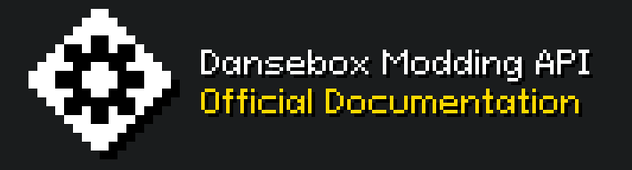

# Overview
This is an official documentation for [Dansebox](https://antikore.itch.io/dansebox)'s modding API created using [MkDocs](https://www.mkdocs.org/). This website is hosted through GitHub pages and you can check it at [https://antikoredev.github.io/dbdocs/](https://antikoredev.github.io/dbdocs/)

You're free to ask anything at Dansebox's official [Discord Server](https://discord.gg/GkysgwR8vG).

**Note:** _This documentation is currently a stub, and it's still building. Modding API hasn't been released yet. There are many things not implemented, or implemented but not added here. Use this as a reference for future releases of the game._

## Getting Started

Dansebox uses [Lua](./home/lua.md) as a programming language to support mods. You can start learning how to create your own mods at [Getting Started](./getting_started/start.md) page

## Example mod
This is a very basic example mod you can use to try out the api:
```lua
--[[
A simple mod that restarts a level if the player gets hit!
--]]

-- This runs when the mod has been enabled or when the game is opened while being enabled.
function onLoad()
	console.log("One-hit Mod Enabled");
end

-- This runs when the mod has been disabled or the game is closed while being enabled.
function onUnload()
	console.log("One-hit Mod Disabled");
end

-- This runs every frame the mod is enabled
function onUpdate()
	if (not game.islevel()) then return end
	if (game.hit()) then game.restart(); end
end
```

## Featured Mods
A list of mods already made that should be featured.

*No mods added yet*

## Contribute
You can contribute Dansebox by donating through [Ko-fi](https://ko-fi.com/antikore) ☕✨<br>
You can contribute to this documentation by modifying and improving the markdown files for the pages.
